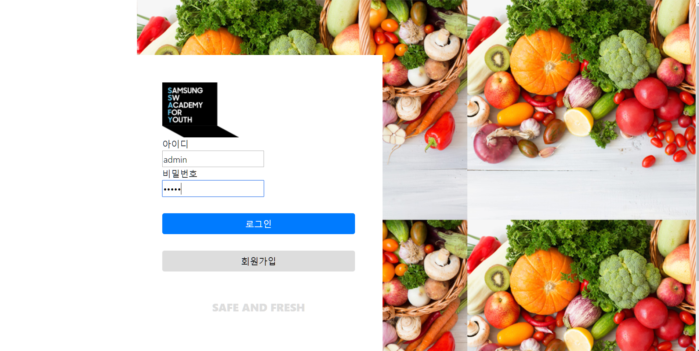
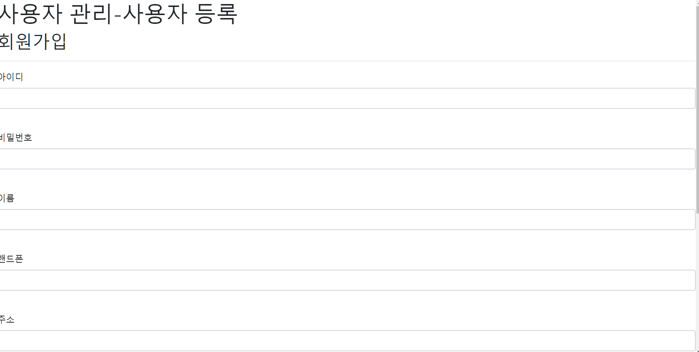
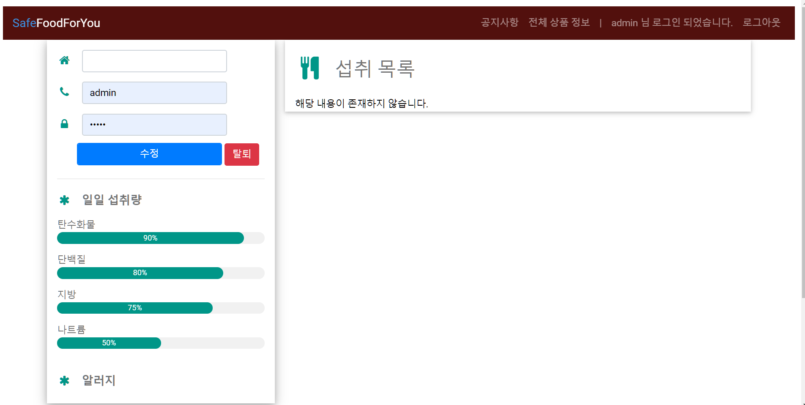
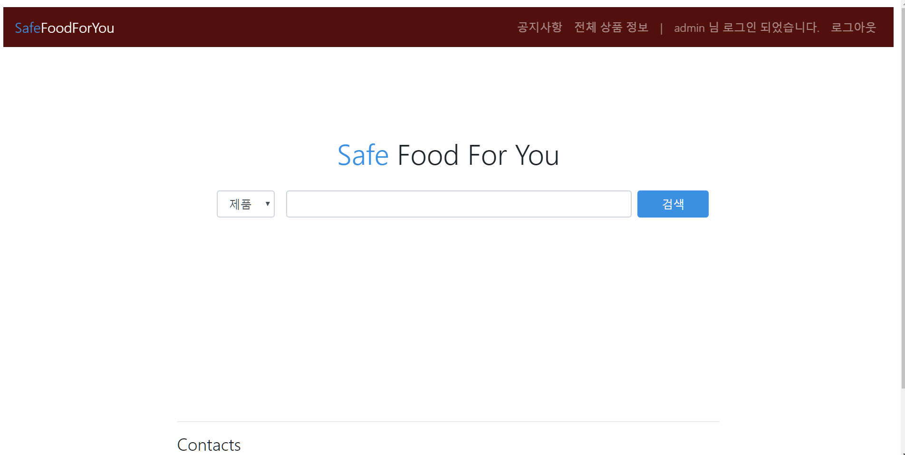
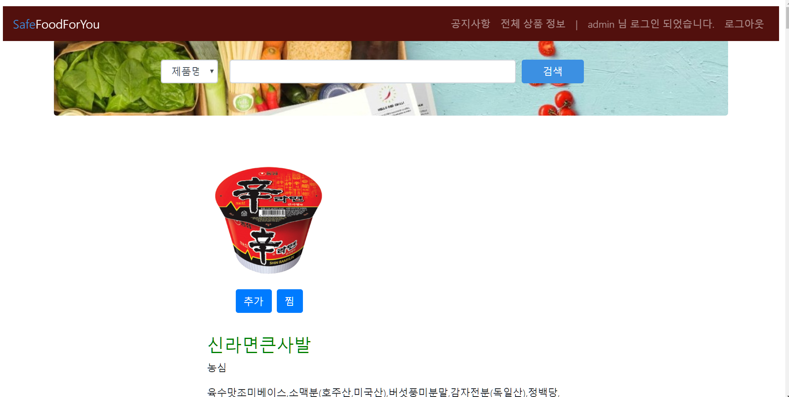
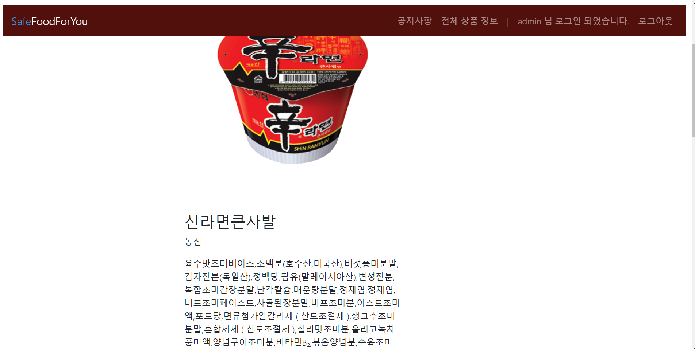
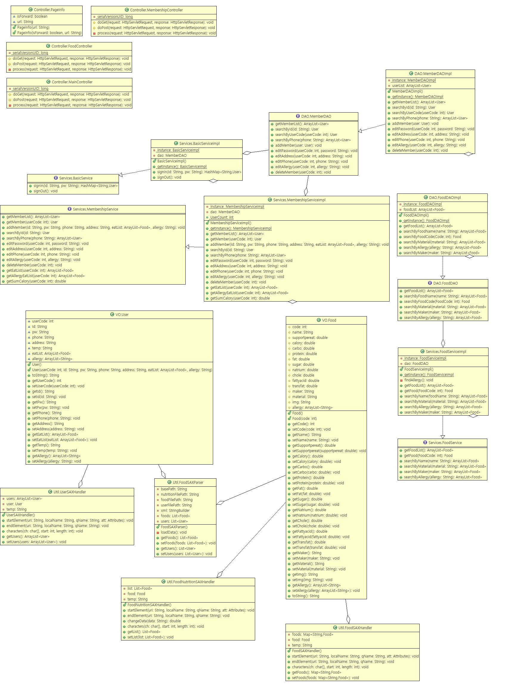
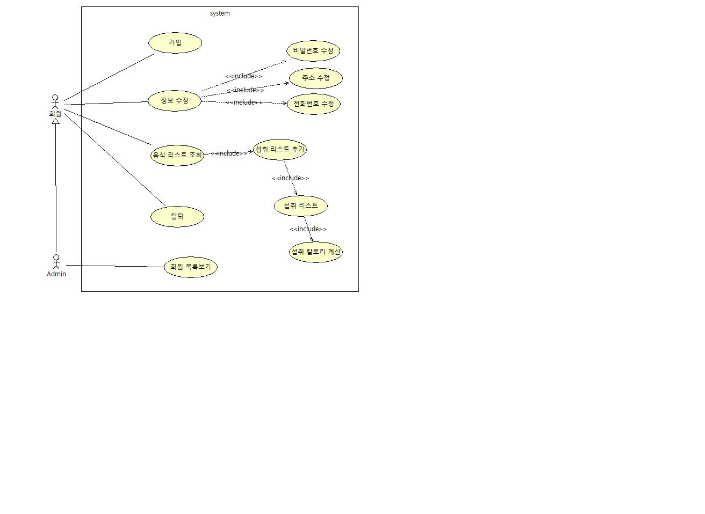

# 구현기능
 1. 회원 관련 기능
  - 로그인 / 로그아웃
    

  - 회원가입
    

  - 회원 정보 조회, 수정, 삭제
    
 

 2. 상품 관련 기능
  - 상품명 / 제조사 / 알러지 / 원재료 별 검색
    
    

  - 음식별 영양정보 및 영양 구성 조회
  - 음식별 알러지 유발 요소 알림
    
 
  - 음식별 알러지 유발 요소 알림
 
  - 마이페이지를 통한 개인 정보 조회

# 구조설계
 1. 클래스 다이어그램
   
   
 2. 유즈케이스 다이어그램
   